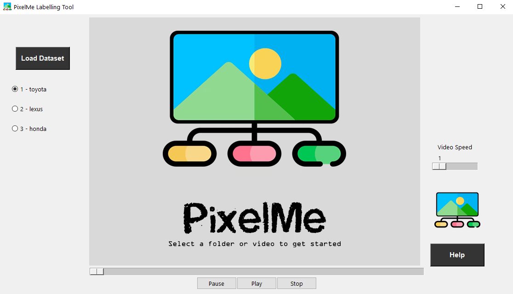

# PixelMe

PixelMe is a tool which allows users to classify images and videos into different categories. This is to label the dataset for image classification algorithm development.




# Setup
To classify all the images within a folder simply use the command
```
python3 PixelMe.py --main_class <YOUR-MAIN-CLASS> --sub_class <SUB-CLASS-1> <SUB-CLASS-2>
```

To classify frames in the video use
```
python3 PixelMe.py --main_class <YOUR-MAIN-CLASS> --sub_class <SUB-CLASS-1> <SUB-CLASS-2> --vid
```

# How to use:
Here I give the example of classifying cars based on brands
```
python3 PixelMe.py --main_class cars --sub_class toyota lexus honda --vid
```
* Click on the load button and select the video file
* When the video is playing use the number keys on your key board to label the frame being displayed
    - Press number key 1 for labelling the frame as toyota
    - Press number key 2 for labelling the frame as lexus
    - Press number key 3 for labelling the frame as honda
* The images can then be found in the folder ./data/cars
* Space bar will pause/play the video. (Only works for videos i.e --vid argument is provided)
* Using the right and left arrow key will
     - Go to next/previous image
     - Forward/rewind the video by 10 seconds
* Use the slider to forward and rewind the video, and the buttons at the bottom to control the video playback
* The slider on the right in the video mode allows you to control the playback speed

## Bugs and feature requests
<b>Head over to the issues tab and feel free to create one</b>

## Credits
The parts of the video player is based on the [Tkinter VLC player](https://github.com/oaubert/python-vlc/blob/master/examples/tkvlc.py)

